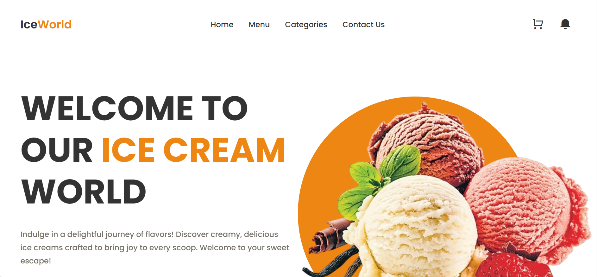

# 🍦 IceWorld – Ice Cream Shop Website  



**IceWorld** is a colorful and delightful **ice cream shop website** designed to showcase delicious flavors, best-selling desserts, and special offers.  
The website delivers a smooth and engaging user experience with a modern layout, vibrant visuals, and responsive design.  
Built using **HTML**, **CSS**, and **JavaScript**, this project focuses on **visual appeal**, **user engagement**, and **clean UI design**.

---

## ✨ Features  

- 🏠 **Home Section** — Eye-catching hero section with brand introduction  
- 🍨 **Popular Ice Cream Menu** — Displays customer-favorite flavors  
- ⭐ **Most Selling Section** — Highlights best-selling ice creams with offers  
- 🎉 **Promotional Banner** — Emphasizes quality, pricing, and services  
- 📩 **Subscribe Section** — Email subscription for discounts and updates  
- 🌐 **Social Media Links** — Integrated icons for social presence  
- 📱 **Responsive Design** — Optimized for mobile, tablet, and desktop  

---

## 🖼 Demo  

👉 **Live Demo:** [Click Here](#)

---

## 🛠️ Tech Stack  

- **HTML5** — semantic structure and accessibility  
- **CSS3** — responsive layouts, animations, and styling  
- **JavaScript (ES6)** — interactivity and navigation behavior  
- **Remix Icon** — clean and modern UI icons  
- **ScrollReveal.js** — smooth scroll animations  

---

## ⚙️ How to Use  

1. **Clone the repository**
   ```bash
   git clone https://github.com/fsafiya187/IceWorld.git

2. **Navigate to the project folder**

cd IceWorld


3. **Open the project**

Open index.html in your browser

---

## 📚 Learning Highlights

Designing a brand-focused landing page

Creating responsive layouts using CSS

Implementing scroll animations with ScrollReveal

Structuring reusable UI components

Enhancing UX with icons and visuals

---
 
## 🧾 License

This project is open-source and available under the MIT License.

---

## 💬 Author

Safiya Fathima
🌐 GitHub: fsafiya187